<!--
  ARYAN.OS · profile README
  Every image here is generated by scripts/ in this repo, in the portfolio's palette and type.
  Static art: python3 scripts/build.py   ·   Live stats: .github/workflows/telemetry.yml
-->

<a href="https://neverthesameagain.github.io/aryanmathur.github.io/">
  
</a>

 

<picture>
  <source media="(prefers-color-scheme: dark)" srcset="assets/sections/work-dark.svg" />
  
</picture>


  

<picture>
  <source media="(prefers-color-scheme: dark)" srcset="assets/sections/build-dark.svg" />
  
</picture>

<a href="https://jozzo.in">
  
</a>

  <a href="https://github.com/neverthesameagain/isitevenhuman-">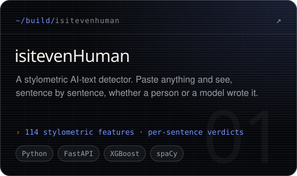</a>
  <a href="https://github.com/neverthesameagain/EIE-Economic-Intelligence-Engine">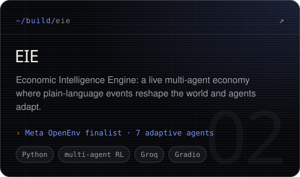</a>
  <a href="https://github.com/neverthesameagain/modest">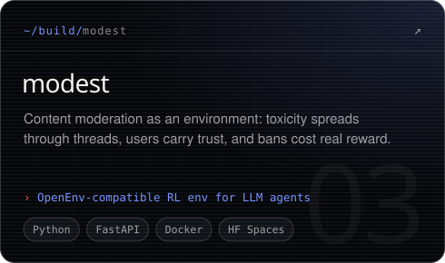</a>
  <a href="https://github.com/neverthesameagain/SpectrumHarmony---RadioResource-Management-for-Arista-Netwrorks">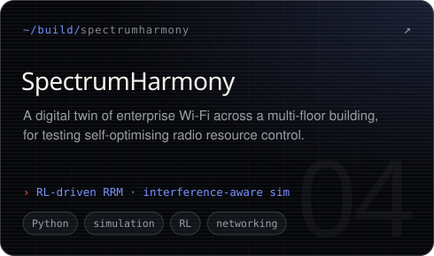</a>
  <a href="https://github.com/neverthesameagain/RecurLens">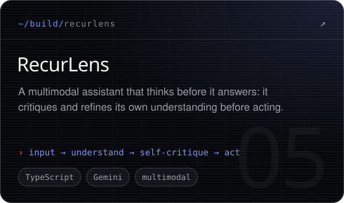</a>
  <a href="https://github.com/neverthesameagain/Autonomous-Ackermann-Explorer">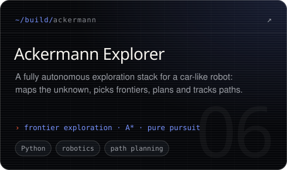</a>

  <code>more from the lab →</code>
  <a href="https://github.com/neverthesameagain/CleaRAG">CleaRAG</a> ·
  <a href="https://github.com/neverthesameagain/LossLess---Amazon-ML-Challenge-2025">LossLess</a> ·
  <a href="https://github.com/neverthesameagain/whatsapp-archive-viewer">whatsapp-archive-viewer</a> ·
  <a href="https://github.com/neverthesameagain/Arithmetic-Coding">Arithmetic-Coding</a> ·
  <a href="https://github.com/neverthesameagain/PanEvaporiMeter">PanEvaporiMeter</a> ·
  <a href="https://github.com/neverthesameagain/Splitzy-Pay">Splitzy-Pay</a> ·
  <a href="https://github.com/neverthesameagain?tab=repositories">all repositories</a>

 

<picture>
  <source media="(prefers-color-scheme: dark)" srcset="assets/sections/lab-dark.svg" />
  
</picture>

<a href="https://arxiv.org/abs/2510.23775"></a>
<a href="https://arxiv.org/abs/2510.23148"></a>
<a href="https://arxiv.org/abs/2406.05152"></a>

<a href="https://scholar.google.com/citations?user=gLHgcBUAAAAJ&hl=en"><code>all publications on Google Scholar ↗</code></a>

 

<picture>
  <source media="(prefers-color-scheme: dark)" srcset="assets/sections/missions-dark.svg" />
  
</picture>


  

<picture>
  <source media="(prefers-color-scheme: dark)" srcset="assets/sections/command-dark.svg" />
  
</picture>

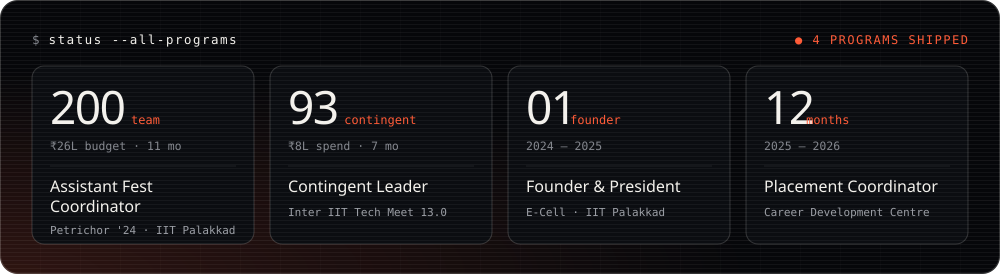

  

<picture>
  <source media="(prefers-color-scheme: dark)" srcset="assets/sections/stack-dark.svg" />
  
</picture>

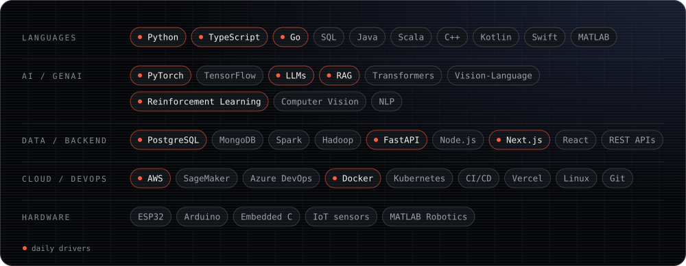

  

<picture>
  <source media="(prefers-color-scheme: dark)" srcset="assets/sections/telemetry-dark.svg" />
  
</picture>


<picture>
  <source media="(prefers-color-scheme: dark)" srcset="https://raw.githubusercontent.com/neverthesameagain/neverthesameagain/output/snake-dark.svg" />
  
</picture>

  

<picture>
  <source media="(prefers-color-scheme: dark)" srcset="assets/sections/contact-dark.svg" />
  
</picture>

  <a href="mailto:aryannmathur@gmail.com">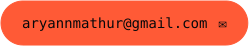</a>&nbsp;
  <a href="https://www.linkedin.com/in/aryannmathur/">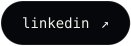</a>&nbsp;
  &nbsp;
  

 


